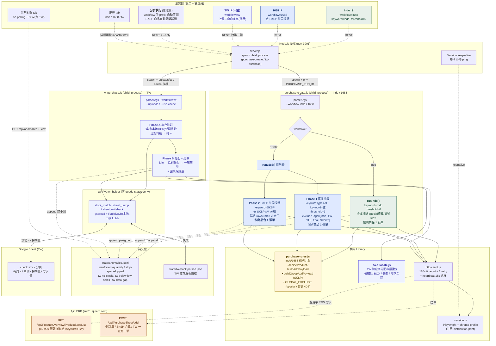
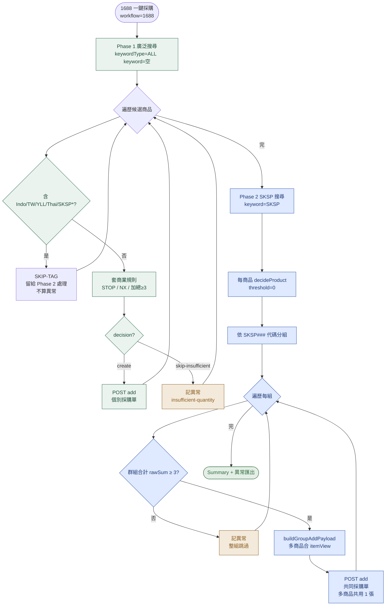
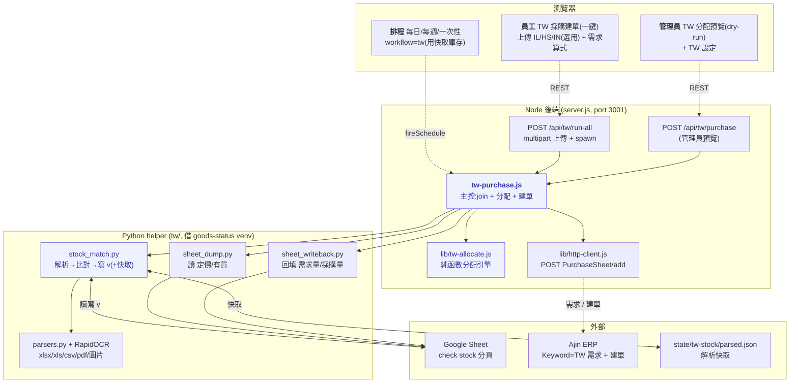
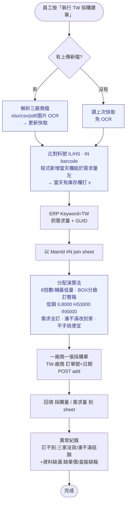
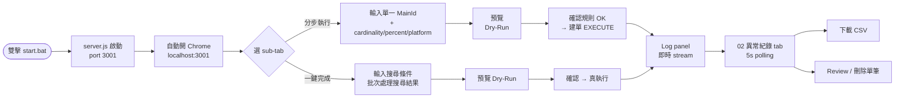

# Justin ERP Purchase

> 阿靳 / 網翼電商經營工具 ERP 智能採購自動建單

把原本 UI 上要逐張慢慢點的智能採購建單作業，壓縮成**輸入條件 → 一鍵建單 → 異常自動分類記錄**。HTTP-direct，不靠 UI 自動化。

支援三種工作流程：

| Workflow | 搜尋方式 | 門檻 | 標籤排除 | 特殊 |
|---|---|---|---|---|
| **Indo** | `Keyword='Indo'` | 規格加總 ≥ 6 | `special` 標籤 / 貨號開頭 `KDS`（全域） | — |
| **1688** | `keywordType='ALL'` 廣泛 | 規格加總 ≥ 3 | `special` 標籤 / 貨號開頭 `KDS`（全域）＋ `Indo`/`TW`/`YLL`/`Thai`/`SKSP*` | **Phase 2 SKSP 共同採購**：同 `SKSP###` 代碼合單 |
| **TW** | `Keyword='TW'` | 廠商低銷金額（IL 8000 / HS 3000 / IN 5000） | 同全域 | **多廠商庫存比對 + 跨廠商分配**：上傳三廠商庫存表 → 比對打勾 → 依低銷分配 → **一廠商一張採購單**；解析快取（庫存沒更新免重傳）。詳見下方 [TW 採購](#tw-採購第三-workflow跨廠商分配) |

> 全域不訂購（兩個 workflow 都跳過，語意同 STOP）：
> - **`special` 標籤**：KeyWord 含 `special`（不分大小寫，精確比對單一 tag）→ `GLOBAL_EXCLUDE_TAGS`
> - **貨號開頭 `KDS`**：`MainId` 以 `KDS` 開頭（例 KDS01 修眉刀 / KDS02 美妝蛋）→ `GLOBAL_EXCLUDE_CODE_PREFIXES`（KDS 在實際資料是貨號前綴，不是標籤）
>
> 定義在 `lib/purchase-rules.js`。

對應流程（客戶逐字稿）：
- 1️⃣ 設定搜尋條件 → 拉候選商品
- 2️⃣ 套訂購條件（**規格加總 ≥ 門檻** + **NX 倍數**）
- 3️⃣ 不訂購原則（**STOP 規格跳過** + **special/KDS 全域標籤排除** + **1688 標籤排除**）
- 4️⃣ 共同採購（**1688 only**：SKSP 同代碼合單）
- 5️⃣ 異常回報（數量不足 / STOP 故沒訂購）

---

## 特色

- **HTTP-direct** — 反推 ERP 前端 JS 找出 `POST /api/PurchaseSheet/add` 的 payload，跳過所有 modal 與按鈕點擊
- **純函數規則引擎** — `lib/purchase-rules.js` 完全無 Playwright/HTTP 依賴，方便獨立測試
- **分步 vs 一鍵兩種模式** — 分步可鎖單一 MainId 測規則；一鍵批次處理搜尋結果
- **即時異常紀錄** — dry-run / execute 都記，per-spec 細粒度（每個被 STOP 跳過的規格各一筆）
- **CSV 下載** — UTF-8 BOM，Excel 開不亂碼；含 mode 欄位區分 dry-run / execute
- **排程** — 每日固定時間 / 一次性執行
- **共用 sister project 的 chrome-profile** — distribution-print 那邊登好的 cookies 直接拿來用，雙專案共用一份 session

---

## 系統架構（含 Indo / 1688 / TW 三 workflow）



**圖例**：
- 🟢 綠色 = Indo workflow（單一商品 1 張單，threshold=6）
- 🔵 藍色 = 1688 workflow（兩階段：廣泛 + SKSP 共同採購，threshold=3）
- 🟣 紫色 = TW workflow（多廠商庫存比對 + 跨廠商分配 + 一廠商一單；Node + Python helper + Google Sheet）
- 🟡 黃色 = 純函數規則引擎（共用，無 IO 副作用）
- 🟠 橘色 = ERP API endpoint

**Workflow 入口對照**：

| 員工/管理員 入口 | UI 元件 | workflow 傳遞 | CLI 行為 |
|---|---|---|---|
| 員工 — Indo 卡 | `#indoExecuteBtn` | `workflow=indo`（寫死）| runIndo: keyword=Indo, threshold=6 |
| 員工 — 1688 卡 | `#t1688ExecuteBtn` | `workflow=1688`（寫死）| run1688: Phase 1 + Phase 2 |
| 員工 — TW 卡(一鍵) | `#twAllExecuteBtn` | `workflow=tw`（寫死,multipart）| tw-purchase: Phase A 比對(上傳/快取) + Phase B 分配建單,全 execute |
| 管理員 — TW 分配預覽 | `#twPbPreviewBtn` | `/api/tw/purchase`(dry-run) | 僅 Phase B 試算,不上傳、不建單 |
| 管理員 — 分步執行 | `#stepPreviewBtn` / `#stepExecuteBtn` | `workflow` 依 `stepPlatformKind`（indo / 1688 / **tw**）OR `prefix.startsWith('1688')` 偵測 | 加 `--only MainId`；1688 SKSP 商品時 Phase 2 只跑相關群組；**TW 走 `/api/tw/purchase --only` + `--ignore-low-sales`（單品跳低銷門檻才試算/建得出來）** |
| 管理員 — 排程 | `#schSaveBtn` | dropdown(indo / 1688 / tw)，存到 `schedules.json` | 排程觸發依 `workflow` 跑；`tw` 用快取庫存(`--use-cache`) |

---

## 業務規則決策樹

對每張**候選商品**逐一跑這個樹：


**重點規則** ([完整對應逐字稿 1-6.txt + 鞏固版 (1).txt + 補充-共同採購.txt]):

| KeyWord 含 | 規則 | 兩 workflow 行為 |
|---|---|---|
| `NX`（例 `12X`、`6X`、`8X`）| 每個有 `needpurchaseQty` 的規格，無條件進位到 N 的倍數 | 通用 |
| `STOP` | 進 `product.Remark` 讀 `STOP : <規格清單>`，列名的規格整個跳過（per-spec 記異常）；Remark 沒列規格 → 整品跳過 | 通用 |
| `special` 標籤 / 貨號開頭 `KDS` | 不訂購：整品跳過（最高優先序，SKIP-TAG，不算異常）；`special` 比 KeyWord 標籤、`KDS` 比貨號(MainId)前綴，皆不分大小寫 | 通用（`GLOBAL_EXCLUDE_TAGS` / `GLOBAL_EXCLUDE_CODE_PREFIXES`）|
| `Indo` / `TW` / `YLL` / `Thai` | — | **Indo workflow**: 一般處理；**1688 workflow**: SKIP-TAG（排除）|
| `SKSP###`（例 `SKSP121`、`SKSP02`）| 共同採購供應商代碼 | **Indo workflow**: 忽略；**1688 workflow**: Phase 1 排除、Phase 2 合單 |
| 其他（`150%` / `New0516` / `focallure` ...）| 一律忽略 | 通用 |

**加總門檻判斷使用原值**（不放大後）：
- 通過 `≥ 門檻` → 才進 NX 放大 → POST
- 不過 `< 門檻` → 整單不建 + 記 `insufficient-quantity` 異常
- Indo workflow 門檻 = 6；1688 workflow 門檻 = 3

---

## 1688 兩階段工作流程

1688 一鍵採購會 **一個 child process 跑完兩個階段**：



### Phase 1 vs Phase 2 對照

| 項目 | Phase 1（廣泛）| Phase 2（SKSP 共同採購）|
|---|---|---|
| 搜尋條件 | `keywordType=ALL` `keyword=空` | `keywordType=Keyword` `keyword=SKSP` |
| 標籤排除 | `Indo`/`TW`/`YLL`/`Thai`/`SKSP*` 全跳過 | 只排除 `Indo`/`TW`/`YLL`/`Thai`（保留 SKSP） |
| 門檻 | 個別商品 `rawSum ≥ 3` | 個別商品 threshold=0；**群組合計 `≥ 3`** 才建單 |
| 採購單粒度 | 一商品一張單 | 同 `SKSP###` 代碼的多商品 → **合成一張單** |
| 異常記錄 | `insufficient-quantity` per-product | `insufficient-quantity` per-group（mainId=SKSP###）|

### 為什麼要兩階段

逐字稿「補充-共同採購.txt」：SKSP 標籤代表這些商品來自**同一個供應商**（例：SKSP121 = 同一個 1688 商家）。實務上要把同代碼的商品**合到同一張採購單**，員工才能跟廠商一次下單、一次收貨。

- 沒有兩階段的話：每個 SKSP 商品個別建單 → 同廠商 6 個商品 = 6 張單，廠商 / 員工都要重複處理 6 次
- 有兩階段：Phase 1 跳過所有 SKSP，Phase 2 統一合單 → 同廠商 1 張單

### 單品查詢（`--only`）特殊處理

分步執行透過 `--only KBT580` 鎖單一商品時，Phase 2 會**自動跳過**（單品查詢的語意不適用於批次合單）。

---

## TW 採購（第三 workflow，跨廠商分配）

TW 跟 Indo / 1688 **本質不同**：不是 per-product 建單，而是把「三家廠商（IL / HS / IN）當週有什麼貨」對上「ERP 算出的需求量」，在**滿足各廠商低銷金額**下，把每個規格的需求量分配給有貨廠商，最後**依廠商各開一張採購單**。分兩個子系統：

- **子系統 A — 庫存比對**：上傳三廠商庫存檔（IL=Excel+照片 / HS=PDF / IN=Excel；圖片 / Excel / CSV / PDF 皆可、可多檔）→ 解析（含**本地 RapidOCR**，不接 LLM）→ 比對 supplier sheet 料號（IL/HS 比料號、IN 比 barcode）→ **程式自動在「需求量」(紫,單一最右欄)左邊新增一組「執行當天」日期的欄（IL/HS/IN×有庫存/採購量,依廠商上色 IL綠/HS紅/IN藍），把 `v` 打進當天「有庫存」欄（同一天重跑不重建）**。
- **子系統 B — 分配 + 建單**：ERP（`Keyword=TW`）抓需求量 → 以 `MainId #N` join sheet → 分配演算法 → 一廠商一張採購單 POST ERP ＋ 回填採購量 ＋ 異常紀錄。

> **架構**：Node 主導（UI / job / ERP / 建單）＋ Python helper（`tw/`：Google Sheet 讀寫 + 檔案解析 + RapidOCR）。Python 借用 sister 專案 `Justin-goods-status` 的 venv ＋ service account 金鑰（設定在 `tw/tw_secrets.json`，gitignore）。
>
> **庫存每週才更新一次** → 上傳是**選用**：有上傳就重新解析並覆蓋快取（`state/tw-stock/parsed.json`）；沒上傳就用上次快取（免 OCR、秒回）。**欄組日期一律 = 執行當天**；「需求量」(紫) 永遠是**單一最右欄**，每次執行新增的欄組都加在它左邊（同一天重跑只更新當天那組,不重複新增）。

### TW 系統架構



### TW 一鍵流程



### TW 分配規則

| 規則 | 說明 |
|---|---|
| 數量取整 | 散裝（非 BOX，或 BOX 但該廠商無「每箱數量」）：`ceil(max(需求, 最低量) / 6) * 6`（補最低量後進位 6 倍數）；整箱（BOX 且該廠商有每箱數量）：`ceil(需求 / 每箱幾件) * 每箱幾件`（至少 1 箱，**不受 6 倍數影響**） |
| 盒裝判斷 | `BOX` 是 ERP 商品層級標籤，但**成箱與否看各廠商**：有「每箱數量」才訂整箱、沒有就當散裝。每箱數量欄空時，會從第 5 欄 Price 備註的 `MIN N PCS` 推得（例 IN KFD01 一箱 = 40） |
| 單價 / 金額 | 單價單位**依廠商**：`HS` 填每箱價 → ÷ 每箱數量還原成每個；`IL`/`IN` 填每個價。金額 = 每個價 × 數量 |
| 低銷門檻 | IL 8000 / HS 3000 / IN 5000；廠商被分到的總金額 ≥ 低銷才出貨 |
| 分配目標 | 需求全訂（低銷只是出貨門檻）；多家有貨 → 分給最需湊低銷者，**平手挑每個單價最便宜**（缺價排最後）；某家湊不滿 → 改分給別家有貨；都沒人接 → 記異常 |
| 建單 | 一廠商一張單（`TW-IL`/`TW-HS`/`TW-IN`），`PurchasePlatform=TW-廠商`、`PurchasePlatformNo=日期 MMDD` |
| 建欄 / 回填 | **每次 execute 程式自己建欄**：在「需求量」(紫,單一最右欄)左側新增一組「**執行當天**」日期的欄（IL/HS/IN×有庫存/採購量），依廠商上色(IL綠/HS紅/IN藍),同一天重跑不重建。Phase A 打 `v`、Phase B 寫 採購量,並把「需求量」日期同步成當天、寫入需求量值 |
| 比對 key | IL/HS = 廠商料號（後綴變體、`I↔1` OCR 容錯）；IN = barcode（濾掉 `000000…` 補零內部碼） |
| 異常 | `tw-no-stock`（三家沒貨）/ `tw-below-low-sales`（湊不滿低銷）/ `tw-data-gap`（已分配但**缺單價→$0** 或**盒裝查不到每箱數量**）→ 寫 `anomalies.jsonl`，02 異常 tab 可篩 |

完整規格見 [`TW-採購規格.md`](TW-採購規格.md)。

---

## UI 操作流程



---

## 快速開始

### 環境需求
- Node.js ≥ v18（建議 v20+）
- Google Chrome（任一版本，已安裝）
- Windows 10/11

### 安裝

```bash
git clone https://github.com/mamiclores-cloud/Justin-ERP-purchase.git
cd Justin-ERP-purchase
npm install
```

### 設定憑證

```bash
cp secrets.example.js secrets.js
# 編輯 secrets.js 填商店代碼 / 帳號 / 密碼
```

> **共用 chrome-profile**：本專案預設 `secrets.js` 的 `profileDir` 指向 sister project `D:\Justin-ERP-distribution-print\chrome-profile`。如果你只裝這個專案，請改成本專案目錄下的相對路徑：
> ```js
> profileDir: path.join(__dirname, 'chrome-profile'),
> ```
> 然後第一次啟動會閃 Chrome 視窗讓你過 reCAPTCHA。

### 啟動

```bash
# 方法 A: 雙擊 start.bat（一鍵啟動 server + 開瀏覽器）
# 方法 B: CLI
npm start
# 開 http://localhost:3001
```

### 停止

```bash
# 雙擊 stop.bat 或關閉 server 視窗
```

---

## Web 控制台

啟動後訪問 `http://localhost:3001`，三個 tab：

### 01 智能採購建單（深綠色帶）
- **Indo 一鍵採購**：搜尋 `Indo` 標籤商品 → 套規則（threshold=6）→ 個別建單
- **1688 一鍵採購**：廣泛搜尋（threshold=3，排除 `Indo`/`TW`/`YLL`/`Thai`/`SKSP*`）+ Phase 2 SKSP 共同採購 — **一顆按鈕跑完兩階段**
- **分步執行**（管理員）：輸入單一 MainId + 平台（Indo / 1688）→ 預覽 / 建單，1688 + 鎖單會跳過 Phase 2

### 02 異常紀錄
- 紅色 badge 顯示總數
- Filter：類型（數量不足 / STOP 故沒訂購）+ 模式（dry-run / execute）+ MainId/訊息搜尋
- 5 秒 polling 即時更新（在這個 tab 時）
- **下載 CSV**（UTF-8 BOM，Excel 直開不亂碼）
- 清空全部 / 刪單筆

### 03 排程
- 每日固定時間 / 一次性指定時間
- 可勾 EXECUTE 模式

### Header
- 中間：DRY-RUN / EXECUTE 模式 badge
- 右側：session pill（點擊手動 refresh）

---

## CLI 用法

```bash
# Indo dry-run（預設 workflow=indo）
node purchase-create.js --keyword Indo --cardinality SalesCount30 --percent 150 \
                       --platform "indo-Office"

# 1688 dry-run（兩階段：廣泛 + SKSP 共同採購）
node purchase-create.js --workflow 1688 --cardinality SalesCount30 --percent 150 \
                       --platform "1688-Office"

# 真執行
node purchase-create.js ... --execute

# 鎖單測試（單一 MainId,Indo 模式）
node purchase-create.js --keyword KBT580 --keyword-type ProductCode \
                       --cardinality SalesCount30 --percent 150 \
                       --platform "indo-Office" --only KBT580 --execute

# 鎖單測試（單一 MainId,1688 模式 — Phase 2 自動跳過）
node purchase-create.js --workflow 1688 --keyword KBT348 --keyword-type ProductCode \
                       --cardinality SalesCount15 --percent 100 \
                       --platform "1688-Office" --only KBT348

# 只跑前 N 筆（測試用）
node purchase-create.js ... --max-products 5

# 加總門檻（Indo 預設 6;1688 強制 3,參數會被 workflow 蓋過）
node purchase-create.js ... --threshold 6

# Debug 顯示瀏覽器
node purchase-create.js ... --headed --debug
```

完整參數對照：

| 參數 | 預設 | 說明 |
|---|---|---|
| `--workflow` | `indo` | `indo` / `1688` — 1688 走兩階段（含 SKSP 共同採購）|
| `--keyword` | (空) | 搜尋關鍵字（1688 workflow Phase 1 會忽略，固定用 ALL）|
| `--keyword-type` | `Keyword` | `Keyword` / `ProductName` / `ProductCode` / `ALL` |
| `--cardinality` | `SalesCount15` | 需求算式：`SafetyStock` / `SalesCount7` / `15` / `30` / `60` / `90` |
| `--percent` | `100` | 倍率 % |
| `--supplier` | (空) | 供應商 GUID（可空 = 全部） |
| `--platform` | (空) | 採購平台，例如 `indo-Office` / `1688-Office` |
| `--threshold` | `6` | Indo 加總門檻；1688 workflow 強制使用 3 |
| `--only` | (空) | 只跑指定 MainId，逗號分隔（1688 + only 會跳過 Phase 2）|
| `--max-products` | `0` | 0 = 無上限 |
| `--execute` | false | 真的 POST add |
| `--debug` | false | 印完整 payload |
| `--headed` | false | 顯示瀏覽器（debug） |
| `--pause-ms` | `500` | POST 之間 delay (ms) |

---

## 異常紀錄機制

只記**員工真正需要 review** 的兩類（嚴格對應逐字稿 4-1 / 4-2）：

| 類型 | 觸發條件 | 粒度 |
|---|---|---|
| **數量不足** (`insufficient-quantity`) | 同商品所有規格（未被 STOP 蓋掉的）加總 `< 6` | per-product 一筆 |
| **STOP 故沒訂購** (`stop-spec-skipped`) | 規格有 needpurchase=true，但被 Remark `STOP : ...` 列名 | per-spec 一筆 |

**不記**的情況：
- STOP 商品中沒被 Remark 列名的規格成功建單 = 正確結果
- POST 失敗 / API error = 系統訊息（管理員看 log，不給員工看）

存儲：`state/anomalies.jsonl`（append-only JSONL，crash-safe）
- 每行一筆 JSON：`{time, runId, mode, mainId, productName, type, message, specLabel, suggestedQty, rawSum, threshold, tags, ...}`
- `dry-run` / `execute` 都會寫入；用 `mode` 欄位區分

### CSV 匯出

```
GET /api/anomalies.csv?type=<>&mode=<>&q=<>
```

欄位：時間, 模式, 貨號, 商品名稱, 異常類型, 異常訊息, 規格, 建議採購量, 規格加總, 門檻, Tags, RunId

---

## 專案結構

```
.
├── server.js                  # HTTP server + Job Manager + Schedule + Session keep-alive
├── purchase-create.js         # Indo / 1688 主 CLI / 子程序腳本
├── tw-purchase.js             # TW 主控（Phase A 比對 + Phase B 分配建單,spawn tw/ Python）
├── TW-採購規格.md             # TW 完整規格（規則 / 架構 / 分配 / 快取）
├── _fetch-options.js          # 拉 supplier / translocation 選單給 UI 用
├── _keepalive.js              # server 定期 ping ERP dashboard 用
├── record-workflow.js         # （備用）開瀏覽器錄製操作，反推 API 時用
├── secrets.example.js         # 設定範例
├── package.json
├── start.bat / start.ps1      # 一鍵啟動
├── stop.bat / stop.ps1
│
├── public/                    # Web 前端
│   ├── index.html             # 三個 tab
│   ├── style.css              # IBM Plex + 深綠色 accent
│   └── app.js                 # tab 切換 / 表單 / log stream / 異常清單 / 排程
│
├── lib/                       # 共用 Library
│   ├── session.js             # Playwright 登入 + reCAPTCHA fallback（自 distribution-print）
│   ├── http-client.js         # Purchase / Supplier / Translocation 命名空間
│   ├── purchase-rules.js      # Indo/1688 純函數商業規則
│   ├── tw-allocate.js         # TW 跨廠商分配引擎（純函數,可獨立測）
│   └── recorder.js            # 操作錄製器（反推 API 用）
│
├── tw/                        # TW Python helper（借 goods-status venv + gspread + RapidOCR）
│   ├── stock_match.py         # Phase A:解析 → 比對 → 寫 v（+ 快取,上傳選用）
│   ├── sheet_dump.py          # 讀 sheet 定價 / 有貨 → JSON
│   ├── sheet_writeback.py     # 回填 需求量 / 採購量
│   ├── parsers.py             # xlsx/xls/csv/pdf/圖片(RapidOCR) 解析
│   ├── normalize.py           # 料號正規化 + barcode
│   ├── match.py               # 讀 check stock + 比對
│   ├── sheet_write.py         # 新增當週欄 + 打 v
│   ├── config.py              # sheet / 金鑰設定載入
│   └── tw_secrets.example.json
│
# 以下 gitignored，不會 commit：
├── secrets.js                 # 你的實際憑證（Indo/1688 ERP 登入）
├── tw/tw_secrets.json         # TW:sheet id / service account 金鑰路徑 / python 路徑
├── chrome-profile/            # （本專案預設指向 sister project 的，所以本目錄通常無此資料夾）
├── state/                     # 排程 + 異常紀錄 + TW 上傳/快取
│   ├── anomalies.jsonl
│   ├── tw-stock/parsed.json   # TW 庫存解析快取
│   └── tw-uploads/            # TW 上傳的廠商檔
├── analysis/                  # 反推來的 ERP 前端 JS（內部資料）
└── node_modules/
```

---

## API 端點

### 業務操作

| Endpoint | Method | 用途 |
|---|---|---|
| `/api/steps` | GET | 步驟註冊表 |
| `/api/start` | POST | 啟動 job |
| `/api/job/:id?since=N` | GET | Polling log |
| `/api/stop/:id` | POST | 終止 job |
| `/api/suppliers` | GET | 供應商選單（5 分鐘 cache） |
| `/api/translocations` | GET | 集運地點選單 |

### TW 採購

| Endpoint | Method | 用途 |
|---|---|---|
| `/api/tw/run-all` | POST | 員工一鍵（multipart 上傳）→ Phase A 比對 + Phase B 建單,全流程 |
| `/api/tw/run` | POST | 僅 Phase A 庫存比對（multipart 上傳） |
| `/api/tw/purchase` | POST | 僅 Phase B 分配 + 建單（管理員預覽 dry-run；排程也走此邏輯） |

### 異常紀錄

| Endpoint | Method | 用途 |
|---|---|---|
| `/api/anomalies?type=&mode=&q=` | GET | 列表（filter 支援） |
| `/api/anomalies.csv?type=&mode=&q=` | GET | 下載 CSV |
| `/api/anomalies/:id` | DELETE | 刪單筆 |
| `/api/anomalies` | DELETE | 清空全部 |

### 排程

| Endpoint | Method | 用途 |
|---|---|---|
| `/api/schedules` | GET / POST | 列 / 新增 |
| `/api/schedules/:id` | PATCH / DELETE | 編輯 / 刪 |
| `/api/schedules/:id/run` | POST | 立即執行 |

### Session

| Endpoint | Method | 用途 |
|---|---|---|
| `/api/session-status` | GET | session pill 狀態 |
| `/api/session-refresh` | POST | 手動觸發 keepalive |

---

## 反推來源

`POST /api/PurchaseSheet/add` 的 payload `PurchaseSheetViewData` 從 `/Scripts/js/Purchase/purchase-intelligent.js:737-768` 反推：

```js
{
  PurchasePlatform: "indo-Office",   // ← 採購平台（業務唯一必填）
  PurchasePlatformNo: "",
  LogisticsCompany: "",
  LogisticsNo: "",
  ShippingLocationGUID: "",
  ShippingLocationName: "",
  ShippingLocationNo: "",
  PurchaseAllPrice: 0, Discount: 0, TotalWeight: 0,
  TransitFee: 0, PackageFee: 0, TotalPrice: 0,
  Remark: "",
  itemView: [{
    ProductGUID, ProductSpecGUID,
    QTY: "12",                       // 字串型別
    ExchangeRateGUID, ExchangeRate,
    Remark: "",
    PurchasePrice, weight,            // weight 小寫！
    sort: 1                           // 1-indexed
  }, ...]
}
```

「加入清單」「轉採購單」是純前端 state（無 API），直接 POST add 即可。`CheckPurchaseForm` 唯一驗證 = `itemView` 非空。

---

## Sister Project

[**Justin-ERP-distribution-print**](https://github.com/mamiclores-cloud/Justin-ERP-distribution-print) — 出貨端自動化（蝦皮分車 / 不分車 / PDF 列印）

兩專案共用一份 chrome-profile，**不可同時跑**（會搶 Playwright persistent context lock）。

---

## 授權

僅供阿靳 / 網翼電商經營工具 ERP 商店內部使用。**請勿用於攻擊其他 ERP 系統**。
